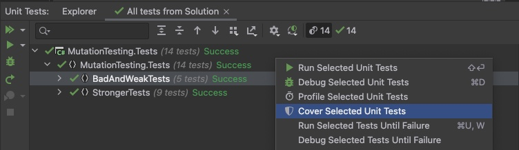
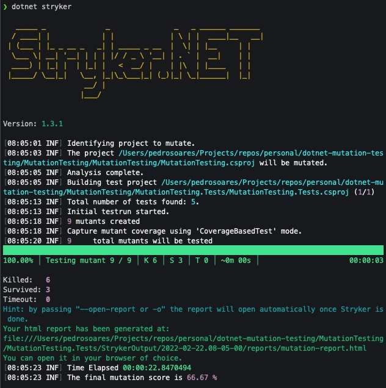
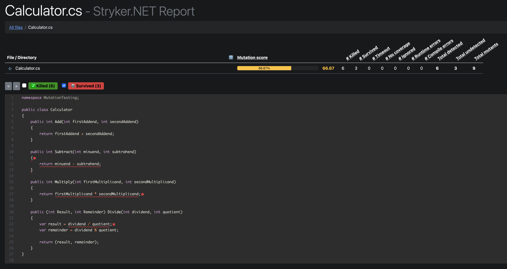
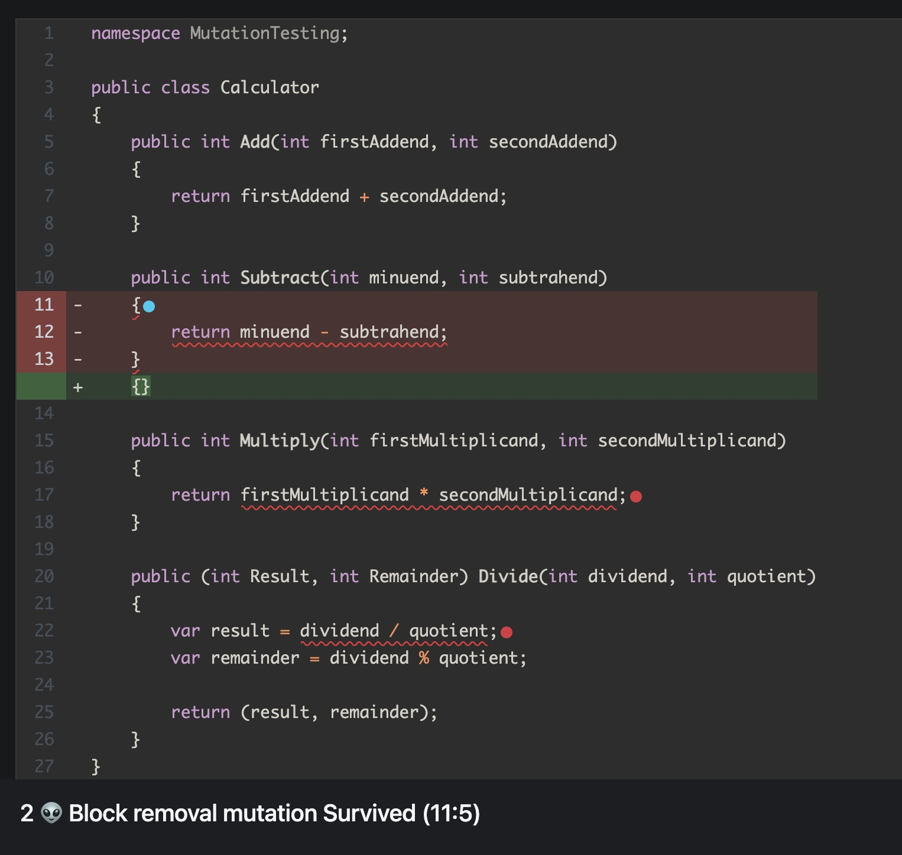
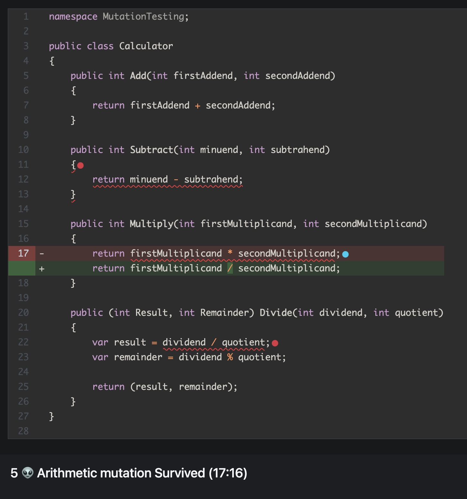
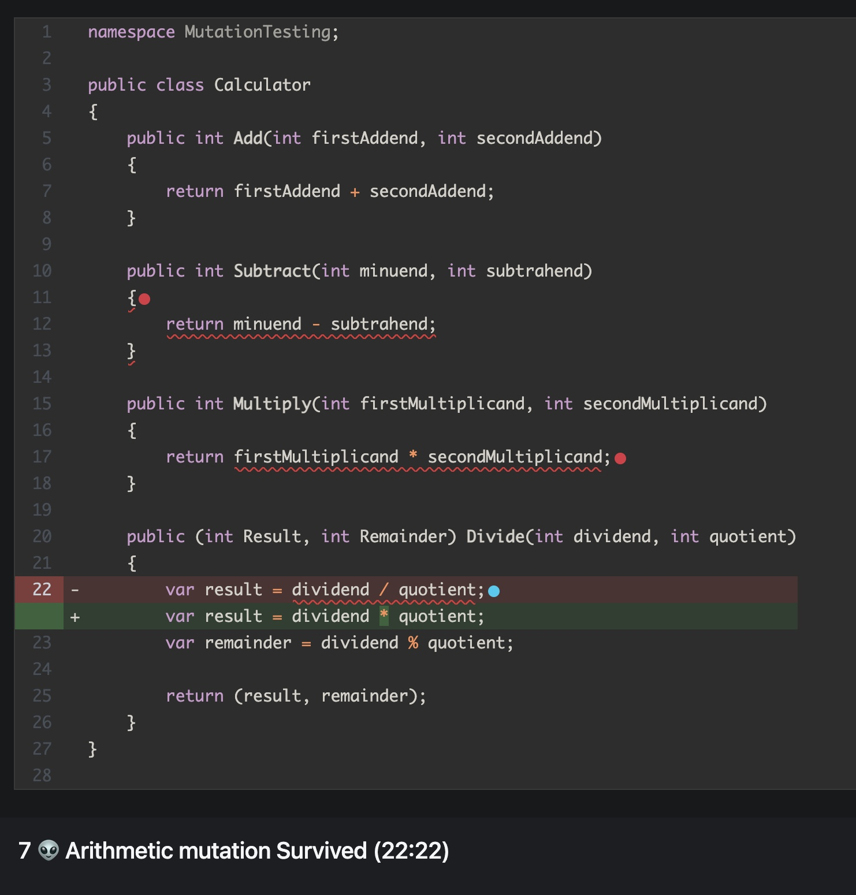

# Weak tests

If we run our tests for this namespace `BadAndWeakTests`, all of them will pass successfully.

And if we go further and analise the tests coverage:



We can see that we got 100% coverage which seems perfect...but it doesn't mean that our code is bullet proof nor our tests well done!

> You must discard the coverage for the `MutationTesting.Tests` project because we don't want to cover our tests but our source code.

You will understand why as soon as you see Stryker in action 👇

Let's run Stryker in our project and analyse the results:



Let's see the generated report:



As we can see, the Stryker could successfully break our calculator source code by inserting some bugs. 
From 4 methods that we have, 3 of them broke which means that our tests are not 👇

### Subtract method bug



The Stryker concluded that our tests are weak because the scenario that it tested, replaced the `return minuend - subtrahend` with `return 0` and the tests passed with success.

Go ahead and test the calculator with the following method:

```csharp
    public int Subtract(int minuend, int subtrahend)
    {
        return minuend - subtrahend;
    }
```

You will see that all the tests pass and the test coverage is still 100% 😱

### Multiply method bug



Once again, Stryker concluded that our tests are weak because the scenario that it tested, replaced the multiplication sign `*` with the division `/` sign and the tests passed with success...

### Divide method bug



In this method, Stryker applied the inverse of the previous method, replacing the `/` sign by `*` sign and the tests passed with success!

Now, let's see how we can improve our tests so they can really test our source code 👇

[Stryker results with stronger tests](../StrongerTests/README.md)