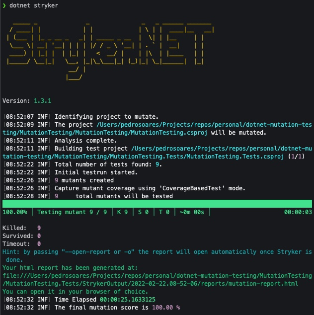
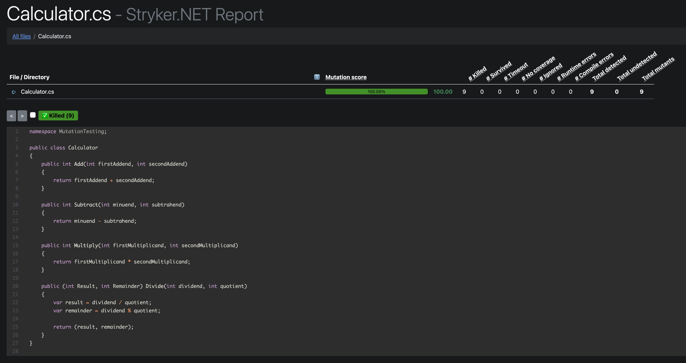

# Stronger tests

To fix all the bugs that Stryker discovered and applied in our calculator source code, we need to change our unit tests or test it with more data.

Let's analise our inline data passed to the methods that broke:

> I've removed the code that we don't need so we can focus on what's important

### Subtract method

```csharp
    public int Subtract(int minuend, int subtrahend)
    {
        return minuend - subtrahend;
    }
```

```csharp
    [InlineData(0, 5, 5)]
    public void Test_Subtract(int expected, int minuend, int subtrahend)
    {
        var result = _sut.Subtract(minuend, subtrahend);
        result.Should().Be(expected);
    }
```

Stryker concluded that our tests are weak because it changed the **Subtract** method body with `return 0` and this was possible because our tests only test a scenario: `5 - 5 = 0` which is equal to `0 - 0 = 0`.

So, we can add at least the following scenario: `[InlineData(5, 10, 5)]` which translates to `10 - 5 = 5`.

### Multiply method

```csharp
    public int Multiply(int firstMultiplicand, int secondMultiplicand)
    {
        return firstMultiplicand * secondMultiplicand;
    }
```

```csharp
    [InlineData(1, 1, 1)]
    public void Test_Multiply(int expected, int firstMultiplicand, int secondMultiplicand)
    {
        var result = _sut.Multiply(firstMultiplicand, secondMultiplicand);
        result.Should().Be(expected);
    }
```

In this case, Stryker concluded that our tests are weak because it changed the `*` sign with `/` because we only tested `1 * 1 = 1` and `1 / 1 = 1` so, our tests are really weak...

In order to cover this, we can add at least the following scenario: `[InlineData(6, 3, 2)]` which translates to `3 * 2 = 6`.

### Divide method

```csharp
    public (int Result, int Remainder) Divide(int dividend, int quotient)
    {   
        var result = dividend / quotient;
        var remainder = dividend % quotient;

        return (result, remainder);
    }
```

```csharp
    [InlineData(1, 0, 1, 1)]
    public void Test_Divide(int expected, int remainder, int dividend, int quotient)
    {
        var result = _sut.Divide(dividend, quotient);
        result.Result.Should().Be(expected);
        result.Remainder.Should().Be(remainder);
    }
```

Here, Stryker concluded that our tests are weak because it changed the `/` sign with `*` because we only tested `1 / 1 = 1` which equals `1 * 1 = 1`.

To make our tests stronger, we can add at least the following two scenarios:

- test the result with 0 remaining: `[InlineData(2, 0, 4, 2)]` which translates to `4 / 2 = 2` with 0 remaining.
- test the result with remaining different from 0: `[InlineData(2, 1, 5, 2)]` which translates to `5 * 2 = 2` with 1 remaining.

Now, if we execute stryker again:





Now Stryker didn't find any bugs in source code that our tests couldn't detect. We made our tests stronger 💪